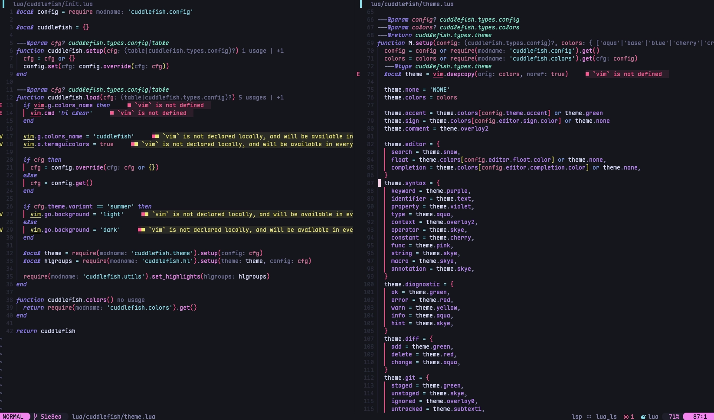

# cuddlefish



a bright, splashy neovim colorscheme inspired by splatoon’s ink battles, made
with love (and high contrast) for my gf who has deuteranopia.

cuddlefish is built to be vibrant, bright and comfy — with clear visual
distinction between syntax elements and playful colors that pop off the screen
(no hue confusion here).

cuddlefish is inspired by [oxocarbon](https://github.com/nyoom-engineering/oxocarbon.nvim), [nord](https://github.com/nordtheme/nord) and [kanagawa](https://github.com/rebelot/kanagawa.nvim).

### features

- bright, high-contrast ink palette (splatoon-inspired)
- color role system with visual weight emphasis (good for color vision deficiencies)
- bold, modern aesthetic (like oxocarbon)
- treesitter syntax highlighting
- lsp semantic highlights

### installation

```lua
-- lazy.nvim
{
  "comfysage/cuddlefish.nvim",
  config = function()
    require('cuddlefish').setup({
      theme = {
        accent = 'pink',
      },
      editor = {
        transparent_background = false,
      },
      style = {
        tabline = { 'reverse' },
        search = { 'italic', 'reverse' },
        incsearch = { 'italic', 'reverse' },
        types = { 'italic' },
        keyword = { 'italic' },
        comment = { 'italic' },
      },
      overrides = function(colors)
        return {}
      end,
    })

    vim.cmd.colorscheme [[cuddlefish]]
  end
}
```
